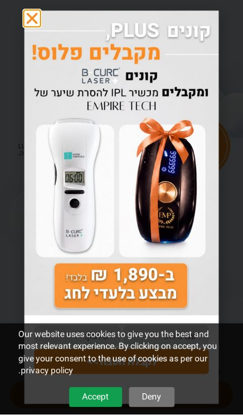
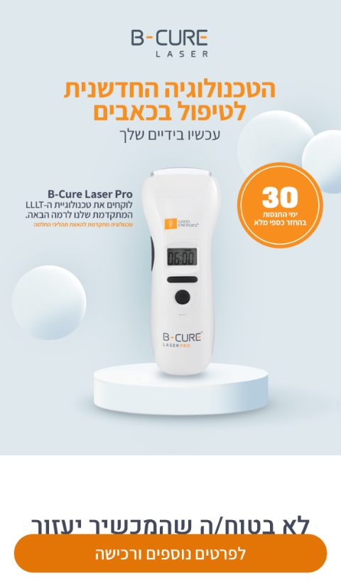
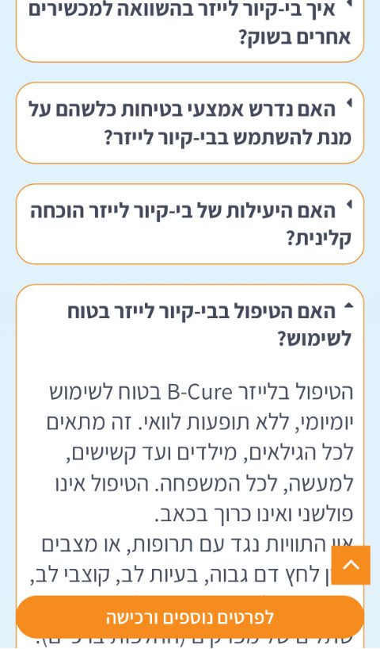
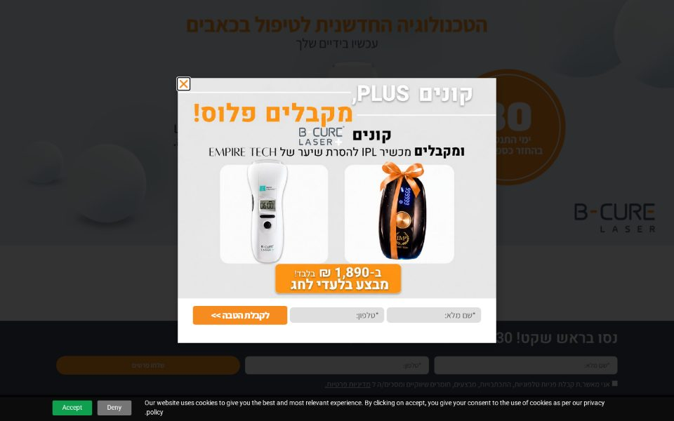
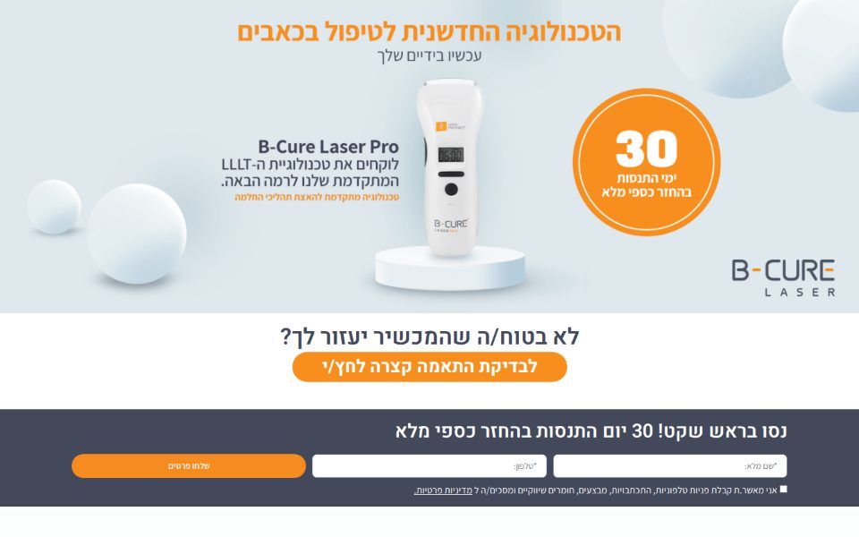
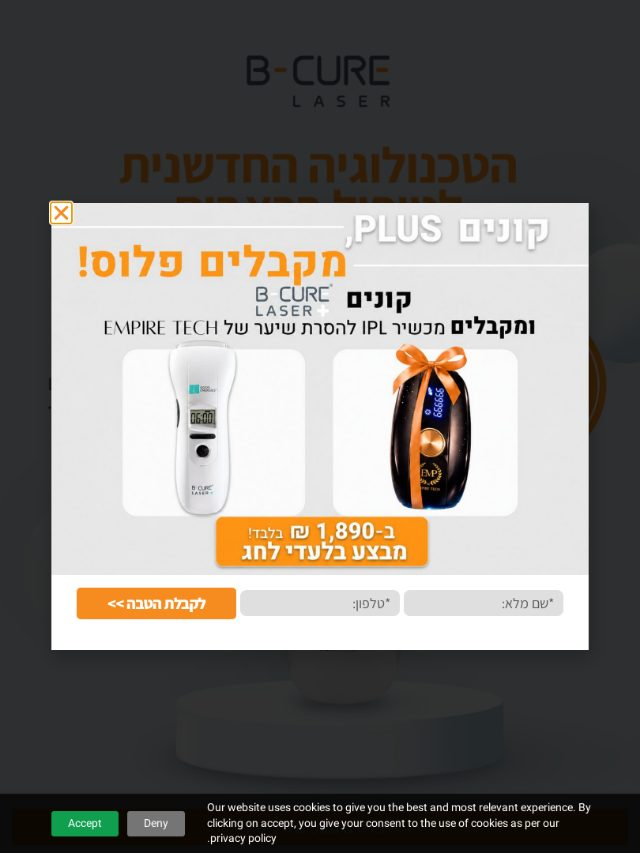

# דוח סריקת QA — lp.bcurelaser.co.il/bcurelaser-v2

- **URL:** https://lp.bcurelaser.co.il/bcurelaser-v2/
- **תאריך:** 2026-09-05
- **כלי:** `scripts/site-scan/scan.mjs` (Playwright/Chromium), 4 viewports: iPhone 13 (390px), Pixel 5 (393px), iPad gen 7 (810px), דסקטופ 1440px
- **אופן הרצה:** `NODE_USE_ENV_PROXY=1 node scripts/site-scan/scan.mjs <url> --out <dir> --via-node` — בסביבת הענן ה-TLS של Chromium נחסם ע"י הפרוקסי, לכן הבקשות נותבו דרך fetch של Node. זמני הטעינה (load/LCP) פסימיים בגלל זה; משקל ומספר בקשות מדויקים (נמדדו לא-דחוסים).
- **פלט גולמי:** `report.md` / `report.json` (פלט הסקריפט כמו שהוא), `screenshots/` (צילומים מכווצים ל-JPEG)

## סיכום

| חומרה | # | ממצא |
|---|---|---|
| 🔴 קריטי | 1 | פופאפ "קונים PLUS מקבלים פלוס" נפתח מיד בטעינה בכל המכשירים ומכסה 100% מהמסך; במובייל באנר העוגיות מסתיר את טופס הפופאפ (שם/טלפון/"לקבלת הטבה") |
| 🔴 קריטי | 2 | כותרת ה-hero ("הטכנולוגיה החדשנית לטיפול בכאבים") היא תמונה — אין H1 ואין טקסט בכלל ב-DOM. הטקסט הקטן שבתמונה לא קריא במובייל |
| 🟠 גבוה | 3 | באנר עוגיות באנגלית בדף עברי, עם באג RTL בפיסוק (".privacy policy"); תופס 22% מהמסך במובייל |
| 🟠 גבוה | 4 | `<title>` פנימי: "25 bcurelaser – Dec sale – בי קיור לייזר" (ספטמבר, לא דצמבר); אין meta description ואין og:image — שיתוף בוואטסאפ יראה קישור עירום |
| 🟠 גבוה | 5 | אין אף קישור `tel:` או וואטסאפ בדף. הקהל (ראו "סיפורי הצלחה") מבוגר — חסר ערוץ פנייה מיידי |
| 🟠 גבוה | 6 | משקל: ~4.7MB סקריפטים (לא דחוס), 160–170 בקשות, 27 דומיינים צד-שלישי (GTM, Zoho CRM+PageSense, Facebook, Google Ads, Outbrain, Taboola, Clarity). LCP מובייל 2.7–3.1s, טאבלט 7.7s |
| 🟡 בינוני | 7 | תמונות: 22–35 בלי alt; לוגואי ספקים נשלחים ב-1665×1292 ומוצגים 67×100; בדסקטופ 29 תמונות גדולות מדי (thumbnails של וידאו 1280×720 ל-293×293, תמונת מוצר 1105×1700 ל-135×208) |
| 🟡 בינוני | 8 | אזורי לחיצה קטנים במובייל: חצי סליידר 25×25, צ'קבוקס הסכמה 13×13, כפתורי עוגיות 32px גובה, קישורי פוטר 18px. aria-label של החצים הפוך (prev="שקופית הבאה") |
| 🟡 בינוני | 9 | שלוש שכבות צפות במובייל בו-זמנית: באנר עוגיות + פס CTA דביק (44px) + כפתור scroll-to-top — מסתירים תוכן ה-FAQ בתחתית הדף |
| 🔵 נמוך | 10 | אזהרות GTM4WP בקונסולה: "container code placement OFF" בעוד dataLayer פעיל — הקונטיינר נטען ידנית, כדאי ליישר הגדרות |
| 🔵 נמוך | 11 | שאלות ה-FAQ הן `<a href="">` (7 קישורים "מתים"); עובד, אבל עדיף `<button aria-expanded>` |
| 🔵 נמוך | 12 | טפסים: אין `autocomplete="name"/"tel"`; העטיפות של כפתורי ה-CTA ברוחב 1012px במובייל (מוסתר ע"י overflow, לא נראה) |

**תקין:** אין גלילה אופקית באף viewport · CLS ≈ 0 · `lang=he-IL dir=rtl` · meta viewport תקין · canonical · favicon · 0 תמונות שבורות · 3 טפסים עם `type=tel`, required ו-placeholder · FAQ ופופאפ פועלים · הקישורים "בדיקת התאמה" מובילים ל-`/שאלון/` (200).

**לא באג של האתר:** 2 פיקסלים (c.bing.com, trc.taboola.com) נכשלו ב-ERR_CONNECTION_RESET — חסימת פרוקסי בסביבת הסריקה.

## מדדים לפי viewport

| viewport | רוחב | DCL | load | LCP | CLS | בקשות | משקל (לא דחוס) | גובה דף |
|---|---|---|---|---|---|---|---|---|
| iPhone 13 | 390 | 3.3s | 18.1s | 3.1s | 0 | 166 | 7.6MB | 5510px (8.3 מסכים) |
| Pixel 5 | 393 | 2.9s | 17.5s | 2.8s | 0 | 170 | 7.5MB | 5523px (7.6 מסכים) |
| iPad | 810 | 2.1s | 16.8s | 7.7s | 0 | 165 | 7.5MB | 7536px (7 מסכים) |
| דסקטופ | 1440 | 1.4s | 3.3s | 1.4s | 0.006 | 159 | 8.5MB | 5222px (5.8 מסכים) |

פירוט לפי סוג (iPhone): סקריפטים 65 בקשות / 4.75MB · תמונות 31 / 1.4MB · וידאו 1 / 540KB · CSS 34 / 504KB · פונטים 6 / 184KB · HTML 181KB.

## צילומי מסך

| | |
|---|---|
| מובייל — מה שהמשתמש רואה בטעינה (פופאפ + עוגיות מסתירות את טופס הפופאפ) |  |
| מובייל — אחרי סגירת הפופאפ (באנר עוגיות באנגלית, 22% מהמסך) |  |
| מובייל — hero נקי (כל הטקסט הוא תמונה, אין H1) |  |
| מובייל — FAQ פתוח עם 2 אלמנטים צפים מעל התוכן |  |
| דסקטופ — טעינה (פופאפ) |  |
| דסקטופ — hero נקי |  |
| טאבלט — טעינה |  |

דף מלא — מובייל: `screenshots/mobile-full-1.jpg` … `mobile-full-5.jpg` · דסקטופ: `screenshots/desktop-full-1.jpg` … `desktop-full-3.jpg`.
